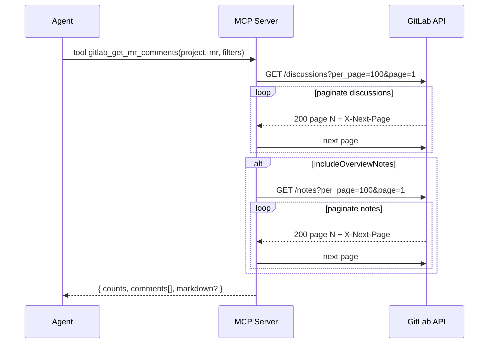

# Product Requirements Document (PRD)

## Title

GitLab MR Comments MCP Server (TypeScript)

## Owner

Alex Lewis (Maintainer)

## Status

Draft → Review → v1.0

## Doc Version

1.0 (Last updated: 2025-11-05)

---

## 1) Summary

Build a lightweight, open-source **Model Context Protocol (MCP) server** that exposes a single tool for retrieving **comments on GitLab Merge Requests**—including inline **discussions** and overview **notes**—so coding agents (Cursor, Claude Desktop, etc.) can pull actionable feedback directly into their context windows.

The server returns a **stable, agent-friendly JSON contract** (and an optional Markdown digest) with filters for unresolved threads, system notes, and pagination handling.

---

## 2) Problem & Context

- Engineers frequently get review comments in GitLab **discussions** (threaded, inline) and **notes** (overview). Bringing those into an AI coding session requires manual copy/paste or unactionable screenshots.
- Existing agent tools lack a **standardized, structured feed** of MR feedback, which limits automated remediation, code-fix planning, and review checklists.
- GitLab’s REST API provides the data, but it requires:

  - Correct endpoint usage (discussions + notes)
  - Auth + pagination + filtering
  - Normalization into a predictable schema that agents can reason about

**Hypothesis**: If agents can pull a stable, complete, filtered view of MR feedback on demand, engineers will resolve comments faster with fewer context-switches.

---

## 3) Goals & Non‑Goals

### Goals

1. **Fetch complete MR feedback**: Inline discussions + overview notes in a unified payload.
2. **Agent‑friendly contract**: Stable JSON schema; Markdown as a readable companion.
3. **Filters**: Include/exclude system notes; unresolved vs. resolved threads.
4. **Scalable pagination**: Fetch all pages (up to 100/page) until completion.
5. **Compatibility**: Works with GitLab.com and self‑managed GitLab via base URL.
6. **Simple setup**: Minimal deps, stdio transport, one tool, documented configs for Cursor and Claude Desktop.
7. **Security**: Token via env; no secret leakage in logs; least‑privilege scopes.

### Non‑Goals (v1.0)

- Editing/creating comments or mutating MR state.
- Rich GitLab search/aggregation across many MRs/projects (future idea).
- Full GraphQL parity (optional tool may land in v1.1+).
- Long‑term caching/persistence layer.

---

## 4) Users & Use Cases

**Primary user**: Senior/staff engineers using Cursor/Claude Desktop for code remediation.

**Use cases**

- _Fix list synthesis_: Agent compiles unresolved comments into a todo plan.
- _Contextual patching_: Agent fetches inline thread + file path to propose targeted diffs.
- _Release readiness_: Agent summarizes remaining blockers across discussions.
- _CI assistant_ (future): Job annotates MR with an aggregated digest.

---

## 5) High‑Level Solution

A TypeScript MCP server exposing a single tool:

```
name: gitlab_get_mr_comments
inputs:
  project: string  # project ID or full path (URL‑encoded path OK)
  mr: number|string # MR IID (the visible !123)
  includeSystem?: boolean = false
  includeOverviewNotes?: boolean = true
  onlyResolved?: boolean = false
  onlyUnresolved?: boolean = false
  perPage?: 1..100 = 100
  format?: 'json' | 'markdown' = 'json'
returns:
  { project, mr, fetchedAt, counts, comments[], markdown? }
```

The tool calls GitLab REST endpoints for **discussions** and **notes**, normalizes results into a unified `comments[]` array, applies filters, and returns JSON + optional Markdown.

---

## 6) Detailed Requirements

### 6.1 Functional Requirements

1. **Fetch discussions**: `GET /projects/:id/merge_requests/:iid/discussions`.
2. **Fetch notes (overview)**: `GET /projects/:id/merge_requests/:iid/notes` (toggle via `includeOverviewNotes`).
3. **Normalize** both into a unified `comments[]` model (see Data Model below).
4. **Filters**:

   - `includeSystem` (default false) to drop GitLab system notes
   - `onlyResolved` / `onlyUnresolved` (mutually exclusive at runtime)

5. **Pagination**: Iterate via `X-Next-Page` headers until exhaustion; `per_page` ≤ 100.
6. **Output variants**: JSON (default) and Markdown (human‑friendly digest).
7. **Auth**: PAT or Project Access Token via `PRIVATE-TOKEN` header; `read_api` scope sufficient.
8. **Self‑managed**: `GITLAB_BASE_URL` env to point at on‑prem instances.
9. **Error handling**: Map HTTP errors to structured MCP error text; include remediation hints.
10. **Rate limits**: Respect headers; exponential backoff and jitter on 429/5xx.
11. **Time ordering**: Preserve chronological order within each discussion; final list may be globally sorted by `created_at` ascending.
12. **IID vs ID correctness**: `mr` is IID (!number). The server must not assume DB IDs.

**Optional (v1.1)**

- `gitlab_get_mr_comments_graphql` tool (single roundtrip GraphQL query).
- `draft_notes` support (if available/desired), behind `includeDrafts: boolean`.

### 6.2 Non‑Functional Requirements

- **Performance**: ≤ 2s p50 and ≤ 5s p95 for MRs with ≤ 500 comments from US region to GitLab.com; document variance for self‑managed.
- **Reliability**: Retries with backoff on transient errors; graceful degradation (partial fetch logs, but fail the tool if critical pages fail).
- **Security**: Never log token values; redact secrets in error output; avoid storing payloads.
- **Portability**: Node.js ≥ 18; zero native addons; stdio transport for broad MCP client support.
- **Observability**: Structured logs (INFO, WARN, ERROR) with request correlation IDs.
- **Schema stability**: Semantic‑versioned changes; avoid breaking changes in 1.x; add fields with backward compatibility.

---

## 7) Data Model

### 7.1 Output Envelope

```json
{
  "project": "my-group/my-proj",
  "mr": 1234,
  "fetchedAt": "2025-11-05T14:30:12.345Z",
  "counts": { "comments": 42, "discussions": 11, "notes": 8 },
  "comments": [
    /* Comment[] */
  ],
  "markdown": "# ...optional digest..."
}
```

### 7.2 Comment

```json
{
  "source": "discussion" | "note",
  "thread_id": "abc123" | null,
  "note_id": 999999,
  "author": { "id": 1, "username": "jdoe", "name": "Jane Doe" },
  "body": "string (markdown)",
  "created_at": "ISO8601",
  "updated_at": "ISO8601",
  "system": false,
  "resolvable": true,
  "resolved": false,
  "resolved_by": { "id": 2, "username": "reviewer" } | null,
  "position": { /* GitLab position object or null */ },
  "file_path": "src/app/index.ts" | null
}
```

**Notes**

- `position` is preserved as-is to retain diff anchors; consumers may ignore.
- `file_path` extracted from `position.new_path || position.old_path`.

### 7.3 JSON Schema (public contract)

> The implementation may use Zod; publish JSON Schema alongside.

```json
{
  "$schema": "https://json-schema.org/draft/2020-12/schema",
  "$id": "https://raw.githubusercontent.com/mpaarating/gitlab-mcp/main/schemas/gitlab-mr-comments.schema.json",
  "title": "GitLab MR Comments Response",
  "type": "object",
  "required": ["project", "mr", "fetchedAt", "counts", "comments"],
  "properties": {
    "project": { "type": "string" },
    "mr": { "type": "number" },
    "fetchedAt": { "type": "string", "format": "date-time" },
    "counts": {
      "type": "object",
      "required": ["comments", "discussions", "notes"],
      "properties": {
        "comments": { "type": "number" },
        "discussions": { "type": "number" },
        "notes": { "type": "number" }
      }
    },
    "comments": {
      "type": "array",
      "items": {
        "type": "object",
        "required": ["source", "note_id", "body", "created_at"],
        "properties": {
          "source": { "enum": ["discussion", "note"] },
          "thread_id": { "type": ["string", "null"] },
          "note_id": { "type": "number" },
          "author": {
            "type": ["object", "null"],
            "properties": {
              "id": { "type": "number" },
              "username": { "type": "string" },
              "name": { "type": "string" }
            },
            "additionalProperties": false
          },
          "body": { "type": "string" },
          "created_at": { "type": "string", "format": "date-time" },
          "updated_at": { "type": ["string", "null"], "format": "date-time" },
          "system": { "type": "boolean" },
          "resolvable": { "type": "boolean" },
          "resolved": { "type": ["boolean", "null"] },
          "resolved_by": {
            "type": ["object", "null"],
            "properties": {
              "id": { "type": "number" },
              "username": { "type": "string" },
              "name": { "type": "string" }
            },
            "additionalProperties": false
          },
          "position": { "type": ["object", "null"] },
          "file_path": { "type": ["string", "null"] }
        },
        "additionalProperties": false
      }
    },
    "markdown": { "type": ["string", "null"] }
  },
  "additionalProperties": false
}
```

---

## 8) Architecture & Design

### 8.1 Components

- **MCP Server (TS)**: One tool `gitlab_get_mr_comments` using stdio transport.
- **HTTP client**: `undici` for fetch.
- **Schema**: `zod` for input/output validation; JSON Schema published.
- **Env**: `GITLAB_BASE_URL`, `GITLAB_TOKEN`.

### 8.2 Sequence (Mermaid)



### 8.3 Error Handling

- **401/403**: Missing/invalid token → message: "Auth failed. Ensure GITLAB_TOKEN with read_api or api."
- **404**: Bad `project` or `mr` IID → message: "Project or MR not found. Verify path vs numeric ID and IID (!number)."
- **429/5xx**: Retry with exponential backoff + jitter (max 3 attempts).
- **Timeouts**: 20s request timeout per page; surface partial progress in logs only.

---

## 9) Security & Privacy

- Tokens provided via env; **never** printed in logs.
- Recommend tokens with **least privilege** (`read_api`).
- No data persistence; memory‑only processing.
- Redact bodies in ERROR logs behind a `LOG_PAYLOADS` dev flag (off by default).
- Document self‑managed TLS considerations.

---

## 10) Configuration & Client Setup

### 10.1 Env Vars

- `GITLAB_BASE_URL` (default `https://gitlab.com`)
- `GITLAB_TOKEN` (required) — PAT or Project Access Token

### 10.2 Cursor (global) — `~/.cursor/mcp.json`

```json
{
  "mcpServers": {
    "gitlab-mr-comments": {
      "command": "node",
      "args": ["/ABSOLUTE/PATH/TO/mcp-gitlab/dist/server.js"],
      "env": {
        "GITLAB_BASE_URL": "https://gitlab.com",
        "GITLAB_TOKEN": "glpat_..."
      }
    }
  }
}
```

### 10.3 Claude Desktop — `claude_desktop_config.json`

```json
{
  "mcpServers": {
    "gitlab-mr-comments": {
      "command": "node",
      "args": ["/ABSOLUTE/PATH/TO/mcp-gitlab/dist/server.js"],
      "env": {
        "GITLAB_BASE_URL": "https://gitlab.com",
        "GITLAB_TOKEN": "glpat_..."
      }
    }
  }
}
```

---

## 11) Developer Experience

- **Repo layout**

  - `/src/server.ts` — MCP server entry
  - `/dist/` — build artifacts
  - `/schemas/` — JSON schema(s)
  - `/examples/` — sample requests/outputs
  - `/docs/` — README, PRD, CHANGELOG
  - Root: `tsconfig.json`, `package.json`, `LICENSE`, `.editorconfig`

- **Scripts**

  - `dev`: ts-node runner
  - `build`: tsc
  - `start`: node dist/server.js
  - `lint`: eslint + prettier (optional)

---

## 12) Testing Strategy

### 12.1 Unit

- Normalize discussion/note objects → `Comment` model (fixtures).
- Filter logic: system/unresolved/resolved precedence.
- Markdown digest rendering (basic snapshot).

### 12.2 Integration

- Live call behind `GITLAB_TOKEN` to a seeded sample MR (document how to create one) **or** wiremock‑style HTTP fixtures.
- Pagination traversal over 2–3 pages.
- 401/403/404/429/5xx handling and retries.

### 12.3 E2E (manual)

- Configure in Cursor and Claude Desktop; issue tool calls; verify outputs.

### 12.4 CI (GitHub Actions)

- Node LTS matrix (18, 20, 22).
- Cache `~/.npm`.
- Job gates: build, unit, integration (fixtures), lint.

**Example workflow** (`.github/workflows/ci.yml`):

```yaml
name: CI
on: [push, pull_request]
jobs:
  build-test:
    runs-on: ubuntu-latest
    strategy:
      matrix:
        node-version: [18.x, 20.x, 22.x]
    steps:
      - uses: actions/checkout@v4
      - uses: actions/setup-node@v4
        with:
          node-version: ${{ matrix.node-version }}
          cache: npm
      - run: npm ci
      - run: npm run build
      - run: npm test --if-present
```

---

## 13) Performance & Scale

- **Pagination cost**: `ceil(total/100)` roundtrips per endpoint.
- **Targets**: ≤ 2s p50 / ≤ 5s p95 for ≤ 500 comments (GitLab.com, US). Document empirical results in README.
- **Mitigations**: Allow users to limit scope via `onlyUnresolved` or disabling overview notes.

---

## 14) Versioning & Release Plan

- **SemVer**:

  - `0.x` for rapid iteration (pre‑stable)
  - `1.0.0` when schema stable and tests pass

- **Artifacts**: npm package optional (not required); GitHub release tags with changelog.
- **CHANGELOG**: Keepers for inputs, outputs, and breaking changes.

---

## 15) Risks & Mitigations

- **GitLab API changes** → Pin to documented endpoints; add smoke tests in CI.
- **Rate limits / transient errors** → Backoff + jitter; document remediation.
- **Self‑managed variance** → Provide base URL config; surface TLS errors clearly.
- **Very large MRs** → Encourage filters; Markdown for quick reading; consider streaming in future.

---

## 16) Alternatives Considered

- **GraphQL‑only**: Fewer roundtrips but less familiar to many; keep as optional tool.
- **glab CLI wrapper**: Adds external dependency; parsing CLI output is brittle.
- **Agent‑side scraping**: Fragile, rate‑limited, and unauthenticated; rejected.

---

## 17) Acceptance Criteria (v1.0)

1. Given a valid token and MR IID, the tool returns a combined list of comments (discussions + notes) with correct counts.
2. `onlyUnresolved: true` returns only unresolved resolvable notes.
3. `includeSystem: false` removes system notes.
4. `format: 'markdown'` returns an additional Markdown digest with author, timestamp, and file path when available.
5. Works in both Cursor and Claude Desktop via documented configs.
6. CI green across Node 18/20/22; README covers setup, examples, and troubleshooting.

---

## 18) Repository Deliverables (GitHub‑ready)

- **README.md**

  - What/Why
  - Quickstart (install, env, run)
  - MCP client configs (Cursor/Claude)
  - Tool contract + examples
  - Troubleshooting
  - Security notes (tokens/scopes)
  - License (MIT)

- **/docs/PRD.md** (this document)
- **/schemas/gitlab-mr-comments.schema.json**
- **/examples/**

  - `request.json` (tool args)
  - `response.json` (sample output)
  - `response.md` (sample digest)

- **.github/workflows/ci.yml** (basic CI)

---

## 19) Open Questions

1. Do we need `draft_notes` in v1.0 or treat as v1.1?
2. Add `projectRef` echo (ID + fullPath) by calling `GET /projects/:id` once?
3. Should we allow comment‐level permalink generation to web UI?
4. Include minimal `web_url` to MR for context in output envelope?
5. Add `updatedSince` filter to reduce payloads on repeated pulls (requires client‑side state)?

---

## 20) Appendix

### 20.1 Example Tool Calls

```jsonc
// JSON payload for agents
{
  "tool": "gitlab_get_mr_comments",
  "arguments": {
    "project": "my-group/frontend",
    "mr": 1234,
    "includeSystem": false,
    "onlyUnresolved": true
  }
}
```

```jsonc
// Markdown digest
{
  "tool": "gitlab_get_mr_comments",
  "arguments": {
    "project": "my-group/frontend",
    "mr": 1234,
    "format": "markdown"
  }
}
```

### 20.2 Sample Markdown Digest (truncated)

```
# GitLab MR !1234 comments for my-group/frontend

---
**@jdoe** • 2025-11-05T10:01:22Z • _thread_ **src/app/index.ts**

Please extract this into a utility and add tests.

---
**@reviewer** • 2025-11-05T10:05:18Z • _note_

Nit: naming is a little confusing here.
```

### 20.3 Licensing

- **MIT** by default; include `LICENSE` file.

### 20.4 NPM Package (optional)

- Publish as `mcp-gitlab-mr-comments` for reuse; still runnable as a local MCP server.
